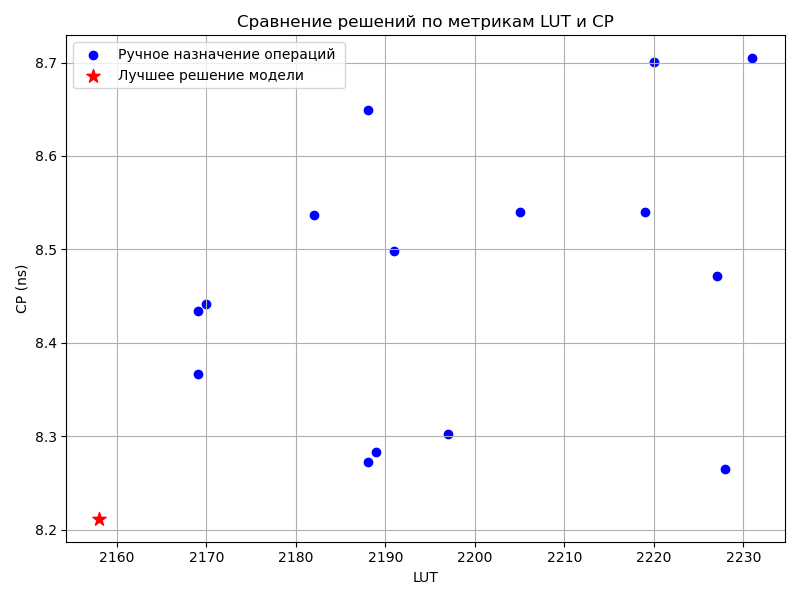

# HLS Design Space Optimization with Machine Learning

**Дипломный проект:**  
Оптимизация пространства проектирования для ПЛИС с помощью методов машинного обучения и обучения с подкреплением.

---

## 📦 Структура проекта

- **/syn_cases/** — генерация и синтез тестовых кейсов (HLS, Vitis)
- **/all_cases/** — примеры сгенерированных кейсов 
- **/optimizer/** — RL-оптимизация (поиск лучших решений)
- **/GNN/** — графовые нейронные сети для предсказания метрик (LUT, DSP, CP)
- **data_preprocess.py, generate_graph_datasets.py, data_info.py** — формирование обучающего набора, анализ данных
- **actor_critic.py, rl_env.py, train_rl.py** — RL-агент для поиска оптимальных решений

---

## 🚀 Как запустить

1. **Генерация кейсов**
    ```bash
    python syn_cases/Gen_one_case.py
    # или
    python syn_cases/Gen_all_cases.py
    ```

2. **Синтез и сбор метрик**
    ```bash
    python syn_cases/Run_all_cases.py
    ```

3. **Формирование обучающего набора**
    ```bash
    python data_preprocess.py
    python generate_graph_datasets.py
    ```

4. **Обучение моделей**
    ```bash
    python GNN/graph_model_lut.py
    python GNN/graph_model_dsp.py
    python GNN/graph_cp_implementation.py
    ```

5. **Оптимизация RL**
    ```bash
    python train_rl.py
    ```

---

## 🛠️ Зависимости

- Python 3.8+
- torch, torch-geometric, pandas, numpy, scikit-learn, matplotlib, seaborn
- Для синтеза: установленный Xilinx Vitis HLS (укажите путь в скриптах!)

Установить зависимости:
```bash
pip install -r requirements.txt
```

> **Примечание:**
> requirements.txt содержит основные библиотеки, используемые в проекте, но не исключено, что для запуска некоторых скриптов потребуется установить дополнительные пакеты вручную. Если при запуске появится ошибка импорта (ImportError), просто установите недостающую библиотеку через pip.

---

## ⚠️ Важно

- В некоторых скриптах путь к Vitis HLS (`D:\Xilinx\Vitis_HLS\2024.2`) прописан явно.  
  **Замените на свой путь к установленному Vitis HLS** или укажите через переменную окружения.
- Папка `/all_cases/` содержит только примеры, для полного обучения используйте сгенерированные данные.
- Папка `/outputs/` не хранится в репозитории — результаты, графики, модели сохраняются туда.

---

## 📊 Пример результата

_Сравнение решений по метрикам LUT и CP:_



---
